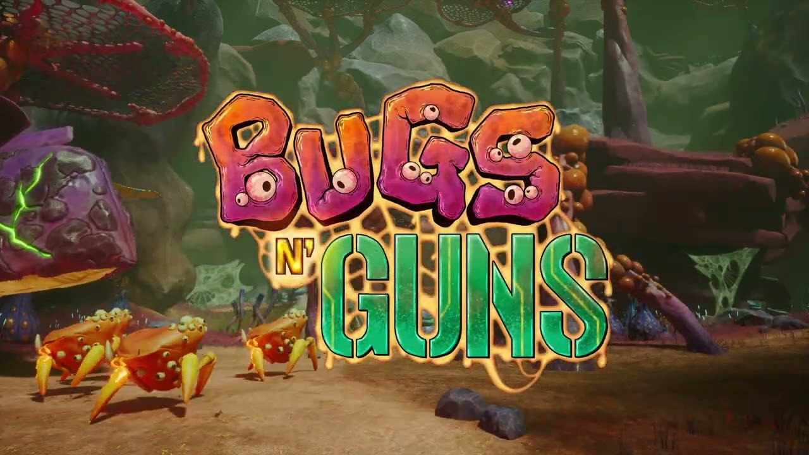
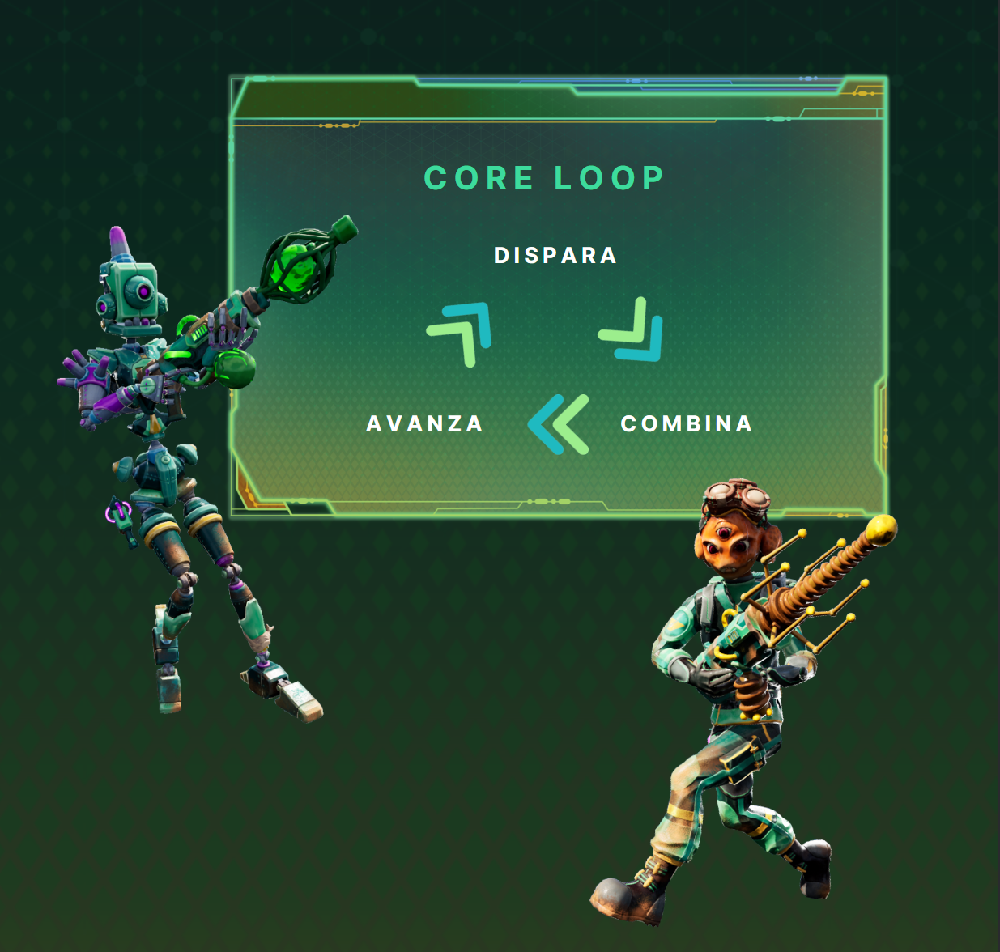
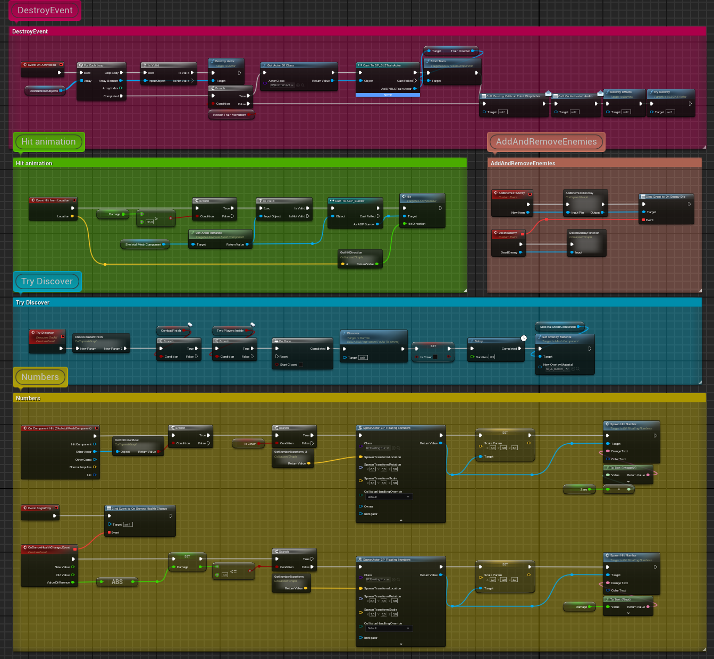
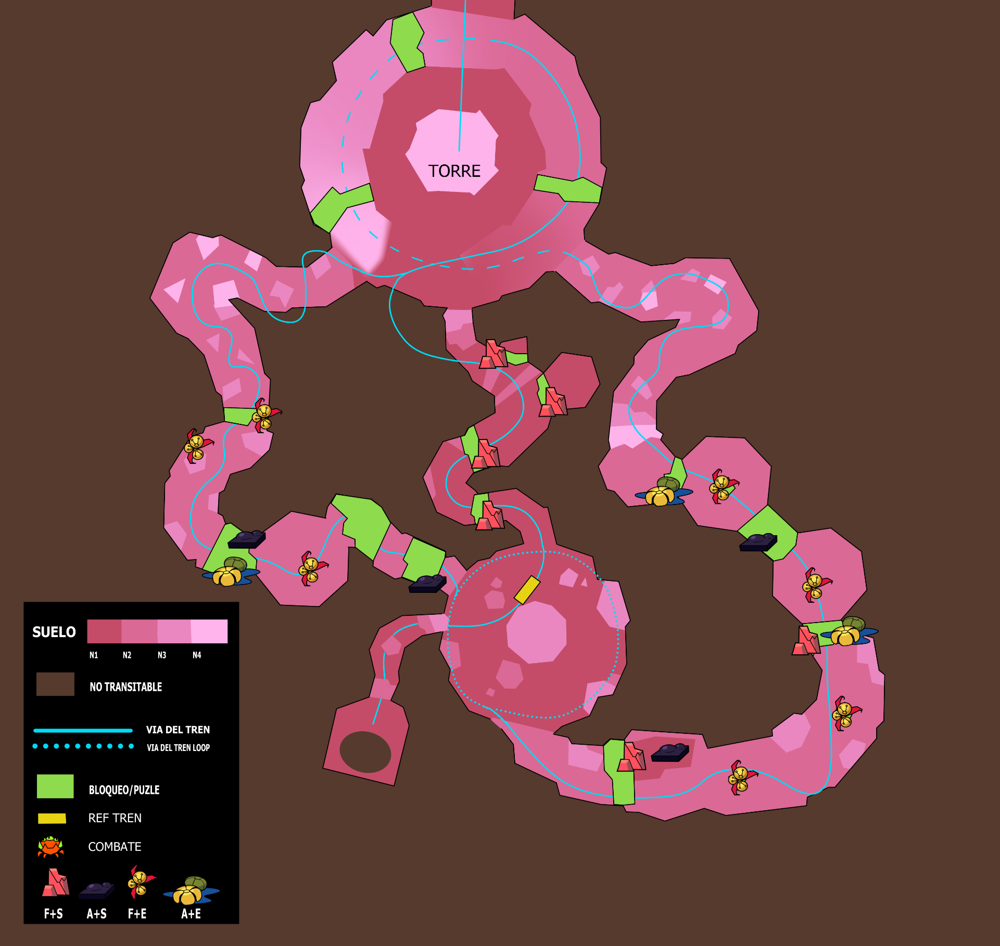
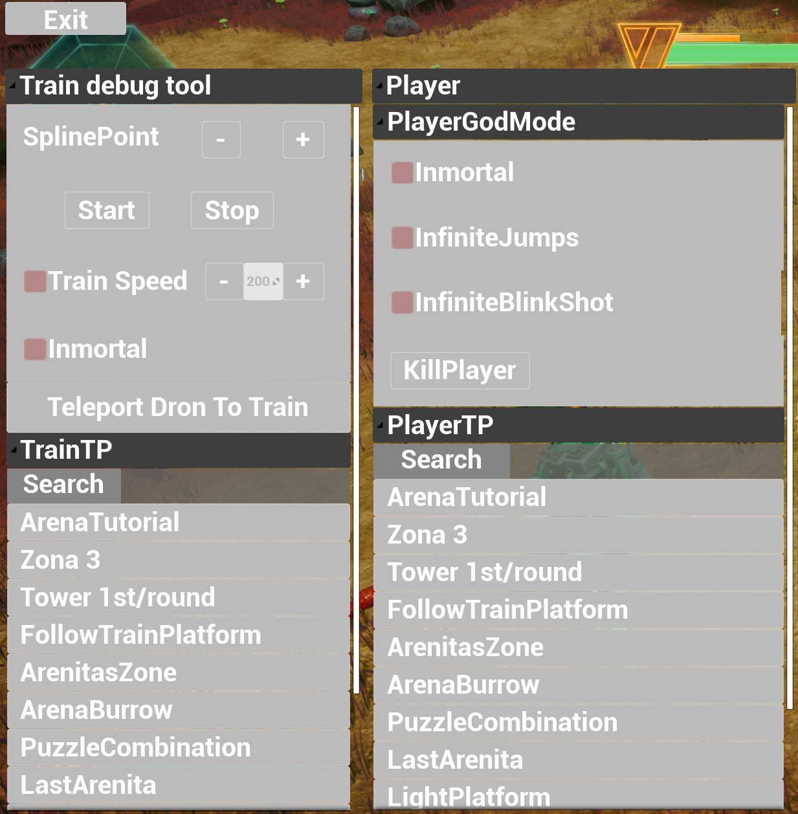
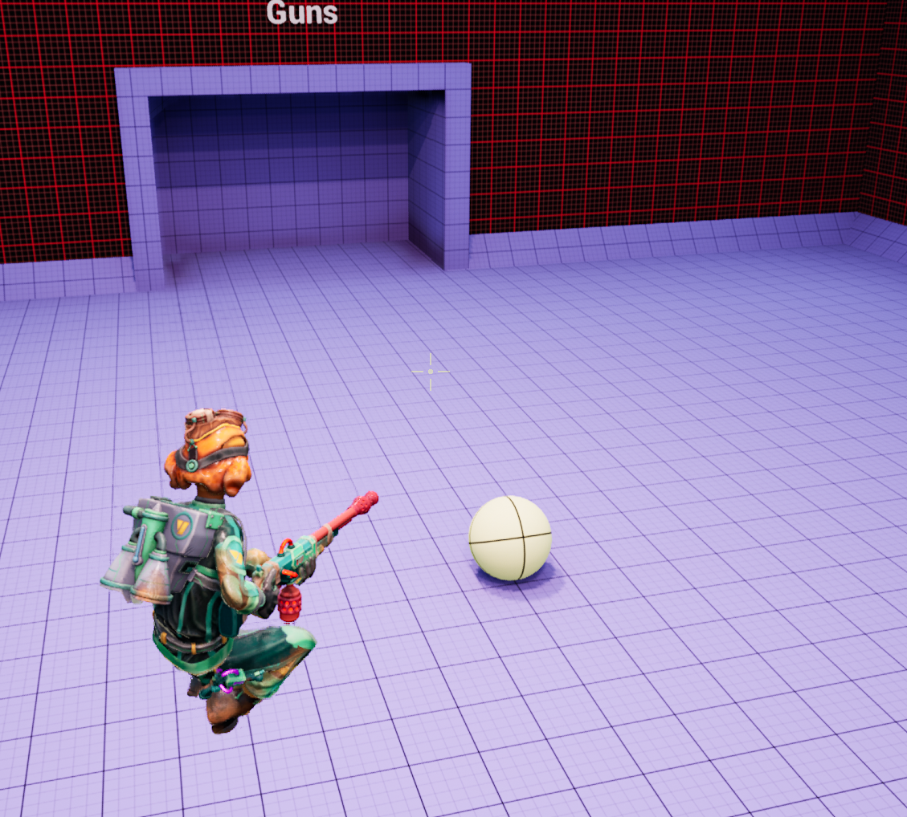
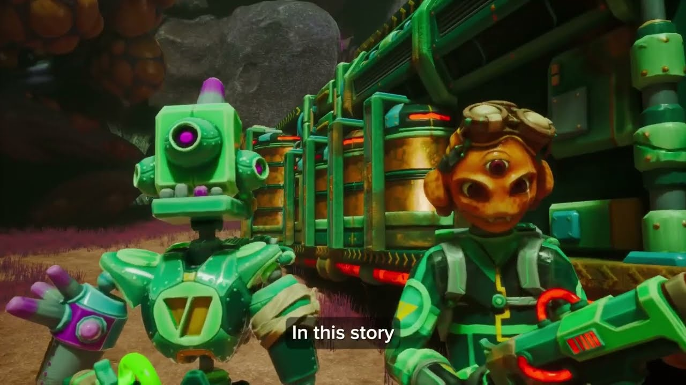

# Bugs 'N' Guns | AlvaroCG-A_Portfolio

- **URL:** https://calvoalvaro12.wixsite.com/-lvarocg-a/copia-de-bugs-n-guns
- **Screenshots:** [desktop](desktop.png) · [mobile](mobile.png)

---
<!-- section 0 #comp-lwi4uk57 — fondo #1e2025 -->

🎬 **Vídeo youtube:** https://www.youtube.com/watch?v=Yzam-WWlWpI  

embed: https://www.youtube.com/embed/Yzam-WWlWpI

#### BUGS 'N' GUNS

90×89 en pantalla · original: https://static.wixstatic.com/media/1f3734_170c1d31d7af422992d63d0e5f7f61b5~mv2.png

### BIG

129×129 en pantalla · original: https://static.wixstatic.com/media/80e7fad4bf744597af67178c0c76544c.png

Is a 3rd-person co-op shooter where players take on the role of interplanetary garbage disposers. Their task is to escort a train through a hostile alien environment using elemental weapons and combinations to fight against a mysterious race of insects.

I worked as Game Designer and Technical Designer on this game as my Master’s Degree Final Project.

🔘 **[(sin texto)](https://sable-sandalwood-dee.notion.site/6b3e2cf0924a4829b68156f894e69264?v=b19f1f11e7794bb48de4bc0fd682faea)**

### NOTION

### GDD

102×27 en pantalla · original:  *(oculta: carrusel/galería)*

### OnePager

80×22 en pantalla · original:  *(oculta: carrusel/galería)*

### CDD(Sp)

---
<!-- section 1 #comp-lwi4uk5f7 — fondo #1e2025 -->

## My contributions

600×569 en pantalla · original: https://static.wixstatic.com/media/1f3734_947e73e095de42859a26f41916af141b~mv2.png

#### Game Design

[I have worked as a game designer from the ideation of Bugs N' Guns until the vertical slice.](https://calvoalvaro12.wixsite.com/-lvarocg-a/copia-de-copia-de-bugs-n-guns)

600×569 en pantalla · original: https://static.wixstatic.com/media/1f3734_be2ac022f3f247ad95c3cc614b139c46~mv2.png

#### Prototyping

[I have worked on the prototyping of Bugs N' Guns, iterating and creating from scratch all the interactables, enemies, weapons, and mechanics using Blueprints in UE5.](https://calvoalvaro12.wixsite.com/-lvarocg-a/copia-de-game-design)

600×569 en pantalla · original: https://static.wixstatic.com/media/1f3734_faa9b11e66834021a9e846c9ccacd5e5~mv2.jpg

#### Level Design

[I have worked on the level design, from the 2D layout and beat chart to the combat arenas and encounter design.](https://calvoalvaro12.wixsite.com/-lvarocg-a/copia-de-toolsandtech)

600×569 en pantalla · original: https://static.wixstatic.com/media/1f3734_a6c1897f203448398eca992a2d24dc16~mv2.png

#### Tools 'N' Tech

[I helped my design teammates by creating tools for a better and faster workflow, and also assisted with various important programming tasks such as level streaming, checkpoints, saves, among others.](https://calvoalvaro12.wixsite.com/-lvarocg-a/wip)

593×569 en pantalla · original: https://static.wixstatic.com/media/1f3734_1638f355368d46f09dea8238bafef34f~mv2.png

#### Blinkball

[In my spare time, I made a minigame as an easter egg where both players face each other in a 'Rocket League-like' game.](https://calvoalvaro12.wixsite.com/-lvarocg-a/copia-de-leveldesign)

## Project Details

Studio: Blinkshot

Genre: Third Person Shooter

Platform: PC

Duration:

Core design and first playable: February 2023 – May 2023

Alpha: May 2023 – July 2023

Beta: July 2023 – September 2023

Gold: September 2023 – Late October 2023

Team Size:

6 Game Designers

6 Programmers

5 Artists

Engine & Tools used: Unreal Engine 5, Maya, Substance Painter, ZBrush.

Other: During this project I was mentored by industry professionals.

🔘 **[(sin texto)](https://twitter.com/BugsnGuns)**

183×181 en pantalla · original: https://static.wixstatic.com/media/1f3734_170c1d31d7af422992d63d0e5f7f61b5~mv2.png

🎬 **Vídeo youtube:** https://www.youtube.com/watch?v=XM_g9x7btv4  

embed: https://www.youtube.com/embed/XM_g9x7btv4
