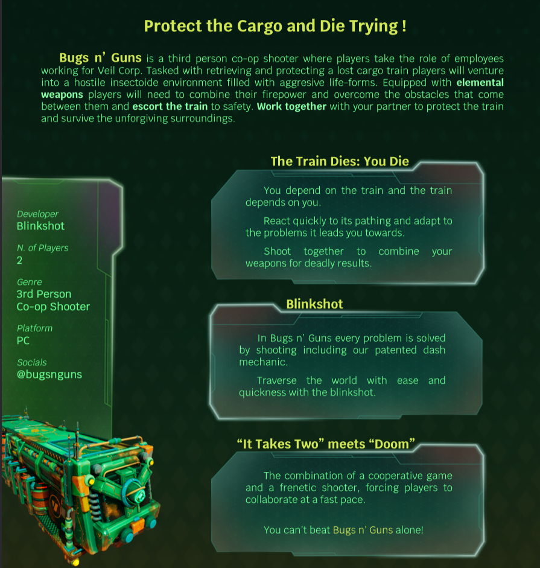
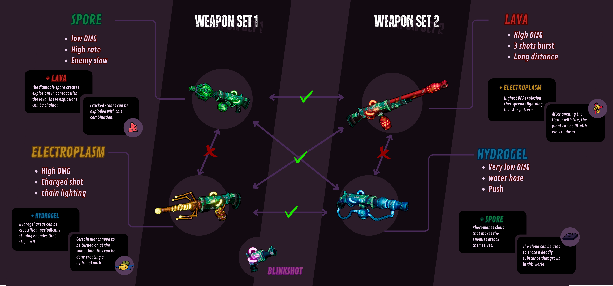

# Game Design | AlvaroCG-A_Portfolio

- **URL:** https://calvoalvaro12.wixsite.com/-lvarocg-a/copia-de-copia-de-bugs-n-guns
- **Screenshots:** [desktop](desktop.png) · [mobile](mobile.png)

---
<!-- section 0 #comp-lwi7nhvc6 — fondo #1e2025 -->

## Game Design

711×772 en pantalla · original: https://static.wixstatic.com/media/1f3734_a1479b31052e4071bff5bf222d5adb4e~mv2.jpg

[One Pager](https://2985fbec-fbea-42c8-b0ec-e741836772d0.filesusr.com/ugd/1f3734_db3252979e94479a8d3b44617b6f59b4.pdf)

As a designer, I have been deeply engaged in shaping the game concept from the start to the vertical slice.  
I have conceptualized the core gameplay loop and established the fundamental design pillars that have influenced all our design decisions.  
I have consistently contributed to and participated in all design meetings, playing a crucial role in every decision throughout the game's development.

I also contributed to the documentation of the GDD for Bugs N’ Guns, focusing primarily on the 3Cs (Character, Camera, Control) and the sections related to combat, encounters, enemies, weapons and interactive elements.

To achieve this, we used Notion to create a comprehensive GDD, and tools like Photoshop and Illustrator to produce detailed documentation for art and programming purposes.

🔘 **[(sin texto)](https://sable-sandalwood-dee.notion.site/6b3e2cf0924a4829b68156f894e69264?v=b19f1f11e7794bb48de4bc0fd682faea)**

### NOTION

### GDD

One of the most challenging tasks in design is to ensure that everyone shares the same vision for the game.

However, it's also the most important because if not, each team member will have a different idea of what is being done, leading to aimless decision-making that can harm the final result.  
  
To tackle this in the design team, we established three pillars and three verbs to build the gameplay upon:

CORE VERBS: Escort, cooperate, shoot

EXPERIENCE PILLARS: Reactivity, Dependence, Frenzy

From these foundations, we designed the entire game, from the core loop to the levels, including weapons, enemies, elemental interactions, and the rest of the mechanics and dynamics present in Bugs N' Guns.

Coming to these conclusions was undoubtedly the most time-consuming part of discussions and meetings for us. However, once we established the anchor on which all our decisions pivoted, the rest came much more easily and naturally (not to say there weren't any discussions), as it was no longer about designing based on what each team member believed to be the most fun, but rather on what best supported those anchors we had set.

That way, when discussing any feature, we always referred back to what aligns best with our pillars to make the decision. In this manner, even if another idea seemed more fun to you, ultimately the team would conclude what was best.

[CDD(Sp)](https://2985fbec-fbea-42c8-b0ec-e741836772d0.filesusr.com/ugd/1f3734_06888f3c870144789cc8dd1eaf834c35.pdf)

🎬 **Vídeo youtube:** https://www.youtube.com/watch?v=XM_g9x7btv4  

embed: https://www.youtube.com/embed/XM_g9x7btv4

715×591 en pantalla · original: https://static.wixstatic.com/media/1f3734_dcd325a4078d4d33b84695d2b390b58b~mv2.png

After establishing our pillars, we began to develop the mechanics and dynamics that would make up the game.

A very representative example of how we followed our pillars in the design process is the elements and their interactions.

The elements and their interactions are one of the central axes on which combat revolves.

This system is designed in such a way that each player has two weapons. These weapons, when combined, produce powerful interactions either on enemies or on the ground.

It is important to clarify that a player's weapons only interact with those of the other player, meaning their two elemental weapons do not create any combinations.

This was decided to promote one of our core verbs, which is cooperation, as well as one of our experience pillars, which is dependency. Without mutual assistance, it will be impossible to progress in the adventure.

Besides combat, the element system is also used in the different puzzles of the game, where players will have to combine their weapons to escort the train through the hostile terrains of Bugs n' Guns.

By doing this with their weapons, we also promote another core verb, shoot, as it was decided that all the actions and puzzles that players have to solve would be done by shooting.

Lastly, a very fast-paced combat was established to generate frenzy, while dynamically changing environments and situations to make players make on-the-fly decisions, promoting reactivity.

We achieve this by changing the environment or adding obstacles that players have to deal with while escorting the train

🔘 **[Bugs N´Guns](https://calvoalvaro12.wixsite.com/-lvarocg-a/copia-de-bugs-n-guns)**
