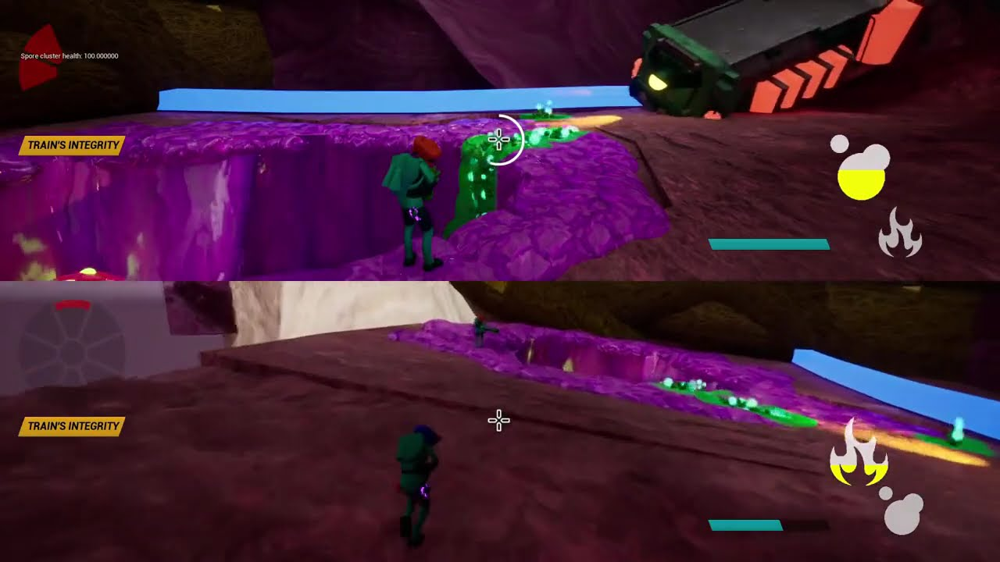
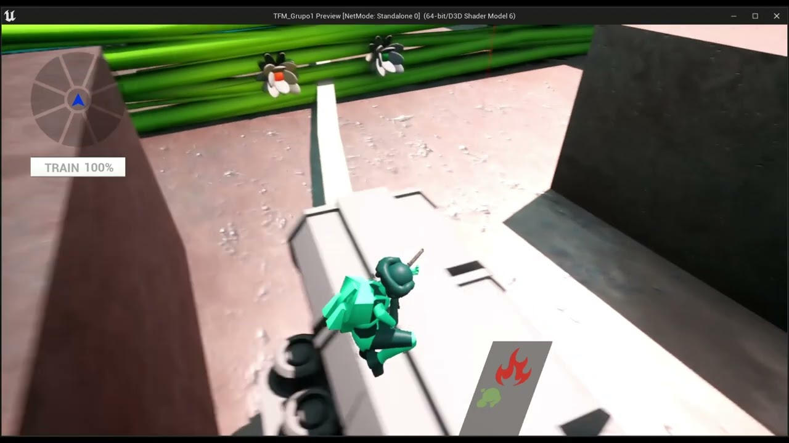
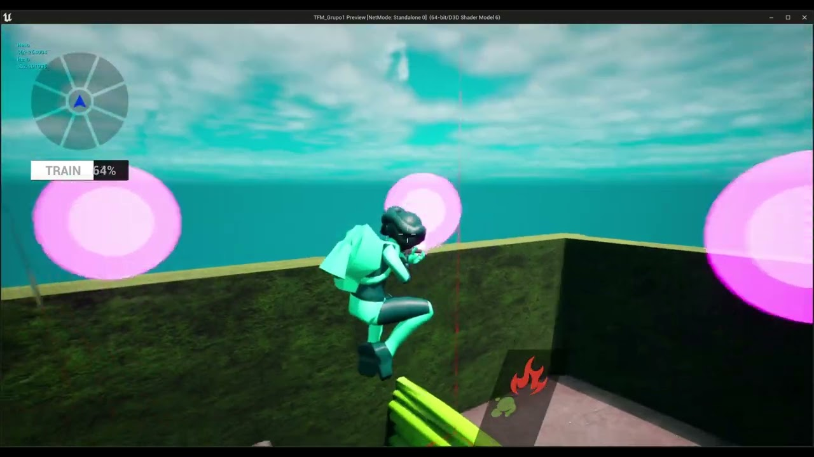
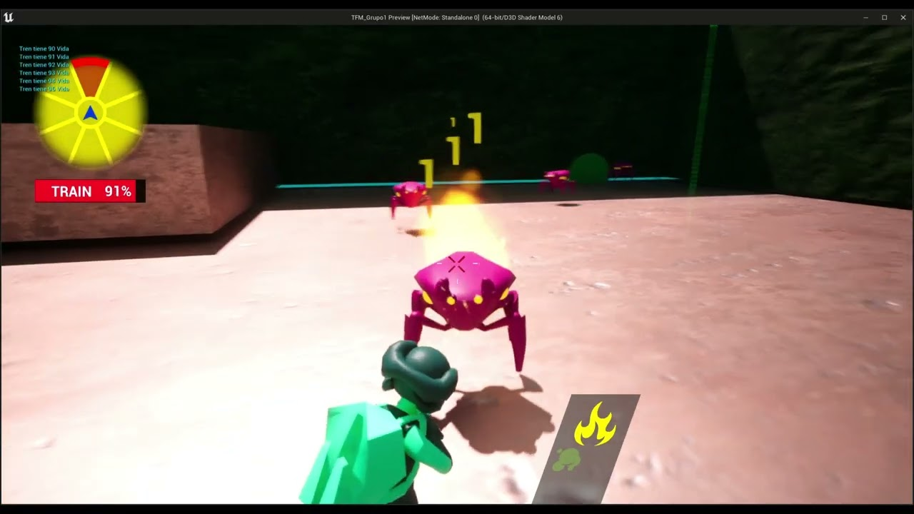
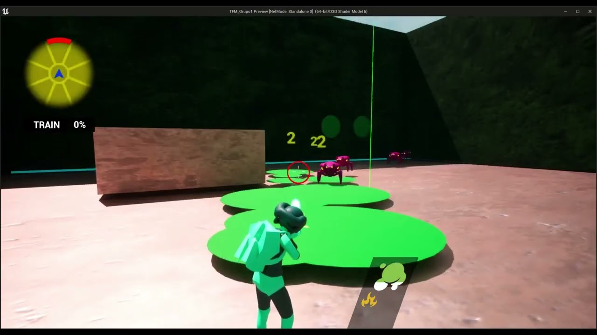
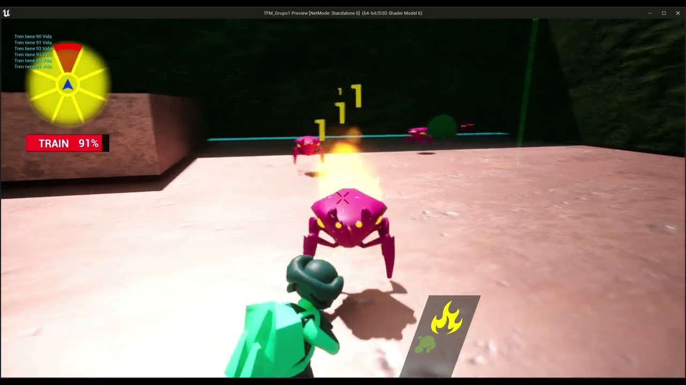

# Prototyping | AlvaroCG-A_Portfolio

- **URL:** https://calvoalvaro12.wixsite.com/-lvarocg-a/copia-de-game-design
- **Screenshots:** [desktop](desktop.png) · [mobile](mobile.png)

---
<!-- section -1 -->

- [Menu](https://calvoalvaro12.wixsite.com/-lvarocg-a/copia-de-game-design)
- [Prototype](https://calvoalvaro12.wixsite.com/-lvarocg-a/copia-de-game-design)
- [3C](https://calvoalvaro12.wixsite.com/-lvarocg-a/copia-de-game-design)
- [Elements](https://calvoalvaro12.wixsite.com/-lvarocg-a/copia-de-game-design)
- [Enemies](https://calvoalvaro12.wixsite.com/-lvarocg-a/copia-de-game-design)
- [Contact](https://calvoalvaro12.wixsite.com/-lvarocg-a/copia-de-game-design)

---
<!-- section 0 #comp-lxbqnrrx — fondo #1e2025 -->

## Prototype & Low level Design

🎬 **Vídeo youtube:** https://www.youtube.com/watch?v=vTBhdAZtNsY  

embed: https://www.youtube.com/embed/vTBhdAZtNsY

This was the look of Bug N´ Guns in the Pre-Alpha.  
This prototype was made by the design team to iterate and valideate mechanics and level ideas.

All the things in the video was made by a designer and I made quite a lot, in this page I will showcase some of the most important and interesting among all.

---
<!-- section 1 #comp-lxktrgy9 — fondo #1e2025 -->

#### Player core mecanics(3C)

One of the key and most important aspects we had to test in-game were the 3C's.

For this, we prototyped a functional character via blueprints with all the features we wanted to test.

There were many, some of which were completely discarded while others were iterated countless times. However, I will only talk about two that were especially important and took several iterations and meetings to address.

🔘 **[(sin texto)](https://sable-sandalwood-dee.notion.site/PLAYER-CCC-2d1cab680b64497980cc05e238e354ce)**

### NOTION

### 3C´s

🔘 **[(sin texto)](https://sable-sandalwood-dee.notion.site/Jumping-cfb2f8fc3ba14e30a5f7f6579502dcd3)**

#### DobleJump

### NOTION

🎬 **Vídeo youtube:** https://www.youtube.com/watch?v=N4DxyZoo71Q  

embed: https://www.youtube.com/embed/N4DxyZoo71Q

🔘 **[(sin texto)](https://sable-sandalwood-dee.notion.site/Blinkshot-8f6e5fa67ef440c29586d23cf079f8ac)**

#### Blinkshot

### NOTION

🎬 **Vídeo youtube:** https://www.youtube.com/watch?v=WHnHrLpxWmY  

embed: https://www.youtube.com/embed/WHnHrLpxWmY

The first and most troublesome feature was the jump, specifically the double jump.

We needed this feature because in the game, we escort a train through hostile terrain, and we can be attacked from all directions.

Therefore, it is essential to be able to move quickly from one side of the train to the other.

This meant we needed a considerably high double jump, but giving such a high jump caused the player to move horizontally much more than we intended, and worse, to saty in the air for a very long time.

After many iterations and meetings, we concluded that instead of a double jump, the player would be given a vertical thrust, as if they had two small rockets on their back, providing the height we wanted but without the horizontal inertia.

We also had to add air friction and adjust the gravity values so that jumps in general felt more natural.

It seems obvious now, but at the time, it was a serious issue.

This mechanic is the most representative of the game's essence and also gives the studio its name.

It arises from one of our core verbs: shooting.

This means that all interactions with the world and its systems are done by shooting.

Parallel to this, we realized we needed a tool to provide player mobility. Since the game is fast-paced and player cooperation is essential, we needed a way for them to quickly and dynamically regroup and split up. In other words, we needed some type of dash or blink ability.

Initially, we considered giving a horizontal dash, but our game is also very vertical, and there are situations where you want to move down or diagonally.

Therefore, we needed an omnidirectional tool. After many meetings and iterations, we decided to treat the blink as a shot.

You would choose the direction by aiming and then teleport by shooting. This way, we solved one of the game's mobility problems while reinforcing the idea that everything is done by shooting.

This is one of the core mechanics of the game, and it has many more interactions and functionalities.

However, if I were to explain everything about how this mechanic was conceived and iterated, we would never finish.

There’s still much to discuss about its interactions with enemies and environmental elements, its peculiarities in terms of game feel, and the restrictions in place to prevent players from breaking the level in various ways.

What I’ve explained here is just the ideation process, but this is a mechanic that was adjusted and modified throughout the entire development process.

---
<!-- section 2 #comp-lxktuqg7 — fondo #1e2025 -->

#### Elements and Weapons

Elements and weapons are the players' tools not only for combat and killing enemies but also for all interactions with the world, as in this game, everything is done by shooting.

To develop the weapons and elements we have now, all four weapons were tested and prototyped. These mechanics underwent the most iterations and had the most versions because they needed to function both as combat weapons and puzzle-solving tools.

🔘 **[(sin texto)](https://sable-sandalwood-dee.notion.site/ELEMENTS-269e489d38f5446e8d27e38d62bc7960)**

### NOTION

### Elements

🔘 **[(sin texto)](https://sable-sandalwood-dee.notion.site/Fire-DPS-f383ada3dfc14f3b9b0ea630f5473523)**

#### Fire

### NOTION

🎬 **Vídeo youtube:** https://www.youtube.com/watch?v=uZoiFMmk6YU  

embed: https://www.youtube.com/embed/uZoiFMmk6YU

Fire was a weapon that we were clear on in terms of puzzles, it was fire. The problem arose more on the combat side.

Initially, it was supposed to be like a fire hose, but this concept caused problems with its floor behavior, meaning it left a trail of fire wherever it touched, and that trail caused contact damage.

In other words, it was too powerful.

So, we had to change the concept. After several iterations, ranging from a sniper rifle to a grenade launcher, we finally settled on a burst rifle with three bullets per burst. It's a weapon with high damage but relatively slow.

With this development of the fire weapon, we also decided that the two DPS weapons would be slow and precise but very powerful, while the CC (crowd control) weapons would be very fast, with low damage but excelling at "painting" the level with their elements, creating large CC areas. These, when combined with the other weapons, result in a devastating finale.

🔘 **[(sin texto)](https://sable-sandalwood-dee.notion.site/Spores-CC-f8ff913d5a1c4135b43f3abe776a79fe)**

#### Spore

### NOTION

🎬 **Vídeo youtube:** https://www.youtube.com/watch?v=VWwqmM7BDx8  

embed: https://www.youtube.com/embed/VWwqmM7BDx8

The spore weapon was the one that most closely resembled its final form from the beginning, as it was conceived as a submachine gun and kept that archetype. It didn't cause problems with its interactions, the main thing that changed was the effect it had on enemies.

Initially, it poisoned them, meaning it dealt damage over time. At first, we wanted to differentiate it from fire by having the burn not last over time, it would deal damage and then disappear, while the poison would deal damage over time.

However, this didn't work out, it was clearly the most powerful weapon of all, and its damage potential conflicted with the idea of a CC weapon.

The result was to remove the poison and turn it into a slow effect. As you can see, this weapon didn't cause many problems.

🔘 **[(sin texto)](https://sable-sandalwood-dee.notion.site/Water-Hydrogel-CC-c3debd33f909474ca500d1902eb90406)**

#### Hydrogel

### NOTION

🎬 **Vídeo youtube:** https://www.youtube.com/watch?v=tIn--X-9LRo  

embed: https://www.youtube.com/embed/tIn--X-9LRo

The water weapon was quite problematic, not in its behavior, which we knew from the beginning would be a hose, but in the effects it would cause on enemies, the ground, and their interactions.

We had many ideas for how it would interact with enemies and the ground. Ideas ranged from generating a vortex that trapped enemies when it touched the ground, to creating a bubble that lifted the enemy and then exploded, causing fall damage, and many other crazy concepts we tried with water.

In the end, we decided that when the water touched the ground, it would create a bubble that exploded and knocked enemies back when they touched it. If you hit an enemy directly, the hose would push them back.

On the other hand, the interaction with electricity wasn't problematic. Electrifying the bubbles on the ground would stun enemies and deal damage.

The real challenge was the water-spore interaction, especially since it also needed to work for puzzles. We considered making it grow plants, but this was discarded due to art restrictions.

After several other ideas, we settled on the concept that combining water and spores would create a toxic cloud (similar to what spores used to do) that made enemies turn against each other.

For puzzles, we created a specific water-spore interactuable, but we'll discuss that later.

🔘 **[(sin texto)](https://sable-sandalwood-dee.notion.site/Electroplasm-DPS-e1e04b9cf72947e6a8c9ed9a67ea8f02)**

#### Electroplasm

### NOTION

🎬 **Vídeo youtube:** https://www.youtube.com/watch?v=tIn--X-9LRo  

embed: https://www.youtube.com/embed/tIn--X-9LRo

The electric weapon was much simpler to design, but it also had a few ups and downs. We had a clear concept of how the weapon would work. Initially, we wanted it to function like a fusion rifle from Destiny 2. The final concept remained similar, with the main adjustment being that it would fire a single projectile instead of multiple ones.

The damage would vary based on how long the weapon was charged.

The biggest challenge was deciding what the weapon would do to enemies.

We had too many good ideas, making it particularly hard to choose. It was clear that the special effect would only apply if the weapon was fully charged.

The most popular candidates were chain lightning and a stun effect, but both were discarded because they provided too much CC for a weapon intended to be DPS.

In the end, we settled on piercing damage, where each enemy the projectile passed through would reduce its damage.

---
<!-- section 3 #comp-lxktuvcu — fondo #1e2025 -->

#### Enemies

Enemies are a key part of the game, so they obviously took a lot of time and resources to create.

From a design perspective, we iterated on the enemy concepts countless times to meet the game's needs as well as the restrictions of other departments. In my particular case, besides designing the concept of the enemies during various design meetings. I was also responsible for prototyping them, including their interactions with other mechanics and gameplay elements, as well as their AI through behaviour trees, and iterating them until achieving a satisfactory result.

🔘 **[(sin texto)](https://sable-sandalwood-dee.notion.site/ENEMIES-2a75067c74544431abecd884cc34e9df)**

### NOTION

### Ememies

🔘 **[(sin texto)](https://sable-sandalwood-dee.notion.site/Smasher-Mauricio-4e7735800a354204bb4f943fe9123832)**

#### Puckarb

### NOTION

🎬 **Vídeo youtube:** https://www.youtube.com/watch?v=YiysNERDmto  

embed: https://www.youtube.com/embed/YiysNERDmto

The Puckarb is the basic and most common enemy in Bugs N' Guns.

It is a short-range ground enemy with low health that typically appears in groups. One of the most important characteristics of this enemy is its ability to climb, meaning it can be on walls as well as ceilings.

This provides several advantages: first, they create many moments of surprise with ambushes from locations where players are not use to encountering enemies.

At the same time, being always on a surface makes them perfect targets for using weapon combinations to quickly eliminate them.

This enemy was relatively easy to design.

It was clear that we needed a "smasher" type enemy, and given the foundational elements we had established for the game, we needed a "Horde" type enemy as well.

The climbing ability also came naturally, as the train sometimes travels along walls or ceilings, so we needed enemies that could pursue it.

979×461 en pantalla · original: https://static.wixstatic.com/media/1f3734_3d4e17e295a34ce58e6861025e4ae950~mv2.png
