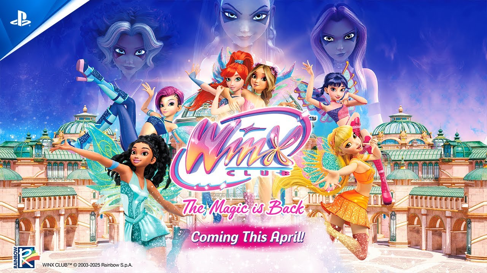
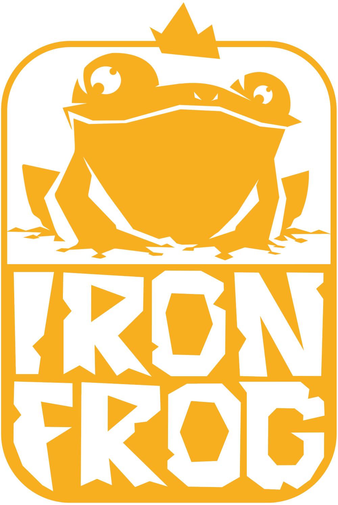

# Winx | AlvaroCG-A_Portfolio

- **URL:** https://calvoalvaro12.wixsite.com/-lvarocg-a/copia-de-neon-red
- **Screenshots:** [desktop](desktop.png) · [mobile](mobile.png)

---
<!-- section 0 #comp-mj7dxpfc — fondo #1e2025 -->

🎬 **Vídeo youtube:** https://www.youtube.com/watch?v=-eAMfL_nJto  

embed: https://www.youtube.com/embed/-eAMfL_nJto

#### Winx Club:

#### The Magic is Back

88×134 en pantalla · original: https://static.wixstatic.com/media/1f3734_e2feabddbf024034be5cb2dd8a7343bc~mv2.png

Winx Club: The Magic Is Back aims to deliver an experience that feels both familiar and entirely new.  
Players will explore some of the most beloved and iconic locations from the Winx universe.  
  
Players can freely switch between all six fairies, each with their own distinctive magical abilities, to overcome enemies and puzzles in creative new ways.

I worked as Game Designer and Combat Designer on this game in Iron Frog

---
<!-- section 1 #comp-mj7dxpg6 — fondo #1e2025 -->

## My contributions

As the game has only been announced and not released yet, I cannot go into detail about my contributions.

However, I can state that I:

Designed and documented the core mechanics (3Cs, Interactions, puzzles, combat abilities, etc.).

Designed and blocked out several levels of the game.

Designed and implemented all combat arenas.

Designed and balance of all the enemies, bosses and minibosses.
