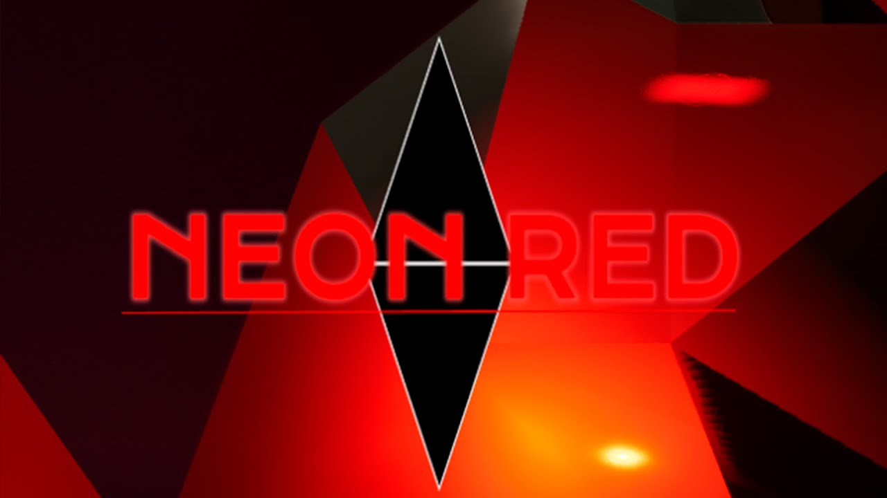
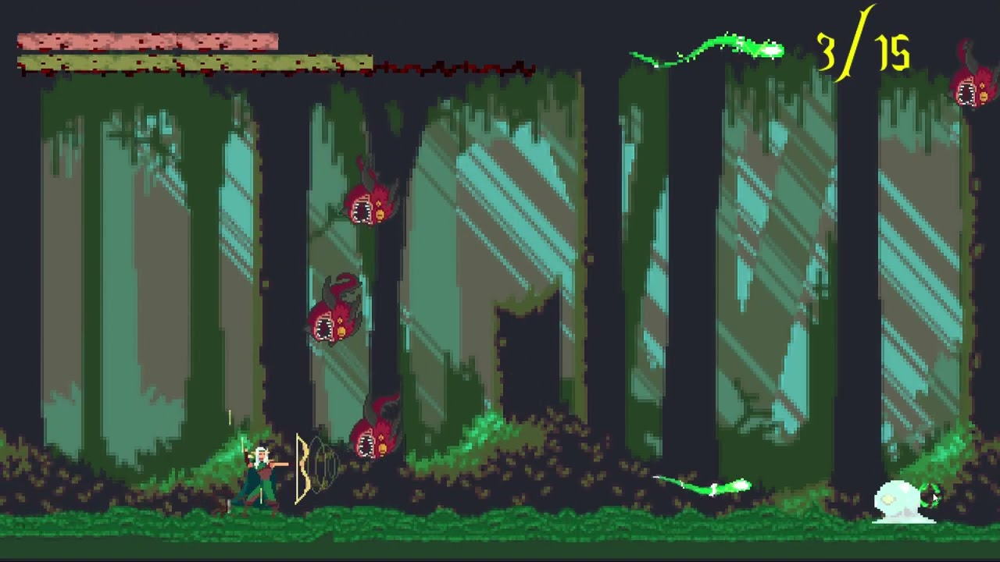
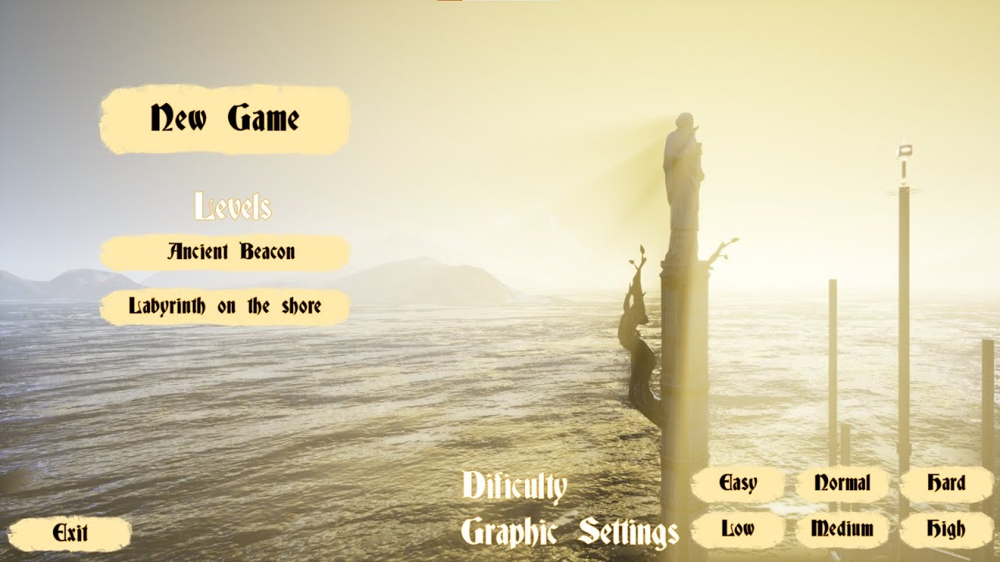

# Personal Projects | AlvaroCG-A_Portfolio

- **URL:** https://calvoalvaro12.wixsite.com/-lvarocg-a/copia-de-portfolio
- **Screenshots:** [desktop](desktop.png) · [mobile](mobile.png)

---
<!-- section 0 #comp-mj792uex2 — fondo #1e2025 -->

#### Neon Red

59×59 en pantalla · original: https://static.wixstatic.com/media/1f3734_92f1c81b690746d0a17f2f16f4e3f745~mv2.png

Neon Red is a platformer for speedrunners. By utilizing the red line connecting your arm and hand, you'll need to use momentum and swings to reach the goal as quickly as possible. Defeat enemies and strive to improve your times.  
  
Are you ready to cross the red line and enter Neon Red?

🔘 **[More Info](https://calvoalvaro12.wixsite.com/-lvarocg-a/copia-de-super-transform-1)**

🎬 **Vídeo youtube:** https://www.youtube.com/watch?v=NoE4qOLrqMI  

embed: https://www.youtube.com/embed/NoE4qOLrqMI

---
<!-- section 1 #comp-mj792uf63 — fondo #1e2025 -->

#### Super_Transform

59×59 en pantalla · original: https://static.wixstatic.com/media/1f3734_92f1c81b690746d0a17f2f16f4e3f745~mv2.png

Super transform is a first person puzzle videogame based on transform different objects to go trought the rooftops.  
  
We wil embody a interdimensional guard that has the mission to save Madrid in a fractured reality in which Madrid has been flooded and is under the vengeful attacks of the squids.

🔘 **[More Info](https://calvoalvaro12.wixsite.com/-lvarocg-a/copia-de-gow)**

🎬 **Vídeo youtube:** https://www.youtube.com/watch?v=pPfRK8eXA9U  

embed: https://www.youtube.com/embed/pPfRK8eXA9U

---
<!-- section 2 #comp-mj792ufe4 — fondo #1e2025 -->

#### Burger Bros Circus

59×59 en pantalla · original: https://static.wixstatic.com/media/1f3734_92f1c81b690746d0a17f2f16f4e3f745~mv2.png

Burger Bros Circus is a 1 vs 1 multiplayer, dodgeball-style game where two gymbros must throw junk food at each other in a circus setting to make the audience laugh.

The game is part of the Global Game Jam 2024 with the theme 'Make me laugh.' It's a hilarious and chaotic two-player experience.

🔘 **[More Info](https://calvoalvaro12.wixsite.com/-lvarocg-a/copia-de-super-transform)**

🎬 **Vídeo youtube:** https://www.youtube.com/watch?v=CI8AUE0d21w  

embed: https://www.youtube.com/embed/CI8AUE0d21w

---
<!-- section 3 #comp-mj792ufm1 — fondo #1e2025 -->

#### Gea Of War

59×59 en pantalla · original: https://static.wixstatic.com/media/1f3734_92f1c81b690746d0a17f2f16f4e3f745~mv2.png

Gea of War is a retro, arcade, 2D, pixel art, shooter videogame in which will control a demigoddess trying to keep the earth safe from contamination. For this, the player will have to manage both his life and that of the earth, channeling the energy of nature through the roots of his bow.  
  
It is a frenetic videogame, in which through some simple mechanics, and the management of the resources that are presented, the player will have to survive as long as possible to try to achieve the best score.

🔘 **[More Info](https://calvoalvaro12.wixsite.com/-lvarocg-a/s-projects-side-by-side)**

🎬 **Vídeo youtube:** https://www.youtube.com/watch?v=SLGUOeP3ZOI  

embed: https://www.youtube.com/embed/SLGUOeP3ZOI

---
<!-- section 4 #comp-mj792ufu4 — fondo #1e2025 -->

#### Against The Clock

59×59 en pantalla · original: https://static.wixstatic.com/media/1f3734_92f1c81b690746d0a17f2f16f4e3f745~mv2.png

#### Against the clock is a simple videogame where you have to colect all the hammers on the map and go through a portal before the clock tick 00:00

was a solo development for BSc Game Design and Development degree.

🔘 **[More Info](https://calvoalvaro12.wixsite.com/-lvarocg-a/s-projects-side-by-side)**

🎬 **Vídeo youtube:** https://www.youtube.com/watch?v=EYnCGiVuaXQ  

embed: https://www.youtube.com/embed/EYnCGiVuaXQ
