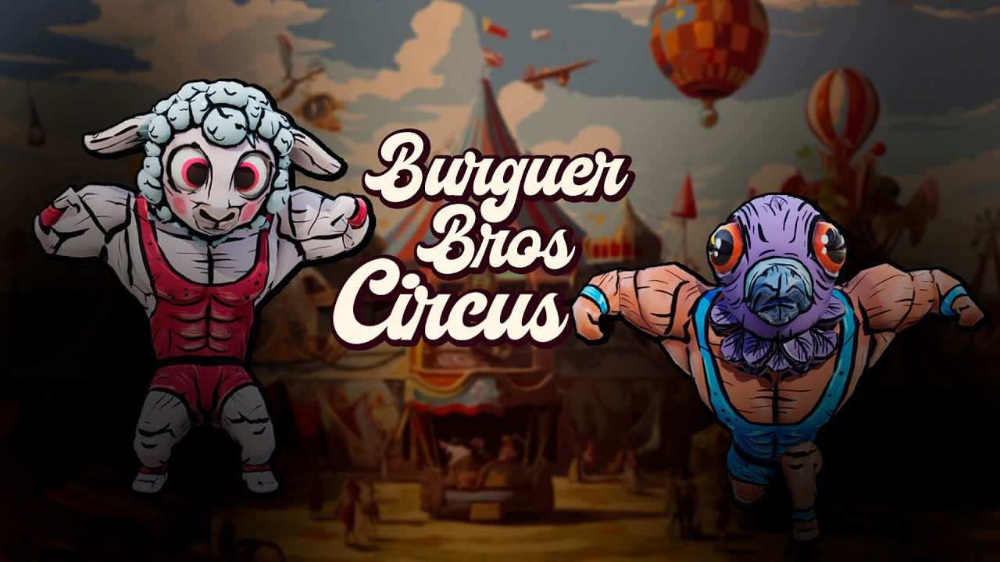

# Burger Bros Circus | AlvaroCG-A_Portfolio

- **URL:** https://calvoalvaro12.wixsite.com/-lvarocg-a/copia-de-super-transform
- **Screenshots:** [desktop](desktop.png) · [mobile](mobile.png)

---
<!-- section 0 #comp-ls90oxqj — fondo #1e2025 -->

🎬 **Vídeo youtube:** https://www.youtube.com/watch?v=CI8AUE0d21w  

embed: https://www.youtube.com/embed/CI8AUE0d21w

#### Burger Bros Circus

68×68 en pantalla · original: https://static.wixstatic.com/media/1f3734_92f1c81b690746d0a17f2f16f4e3f745~mv2.png

Burger Bros Circus is a 1 vs 1 multiplayer, dodgeball-style game where two gymbros must throw junk food at each other in a circus setting to make the audience laugh.

The game is part of the Global Game Jam 2024 with the theme 'Make me laugh.' It's a hilarious and chaotic two-player experience.

I worked as Game Designer and Programmer on this game in the Global Game Jam 2024

---
<!-- section 1 #comp-ls90oxr0 — fondo #1e2025 -->

## My contributions

Designed and Programming multiple mechanics and systems, including, among others:

The 3C:

The camera.

The Contrlol

The character

Shooting mechanics:

Design, programming and implementation of the two types of shooting.

Design, programming and implementation of the projectile trajectory preview.

Design, programming and implementation of the diferent types of ammo and level obstacles.

User interface: Programming and implementation of the UI.

Support the rest of the design and art team with the use of unreal engine, github and others.

## Project Details

Studio: Blinkshot

Genre: Twin-Stick-Shooter

Platform: PC

Duration:

24/January/2024 - 28/January/2024

Team Size:

4 Game Designers

2 Artist

1 Programmer

Engine & Tools used: Unreal Engine 5.

328×328 en pantalla · original: https://static.wixstatic.com/media/1f3734_92f1c81b690746d0a17f2f16f4e3f745~mv2.png
