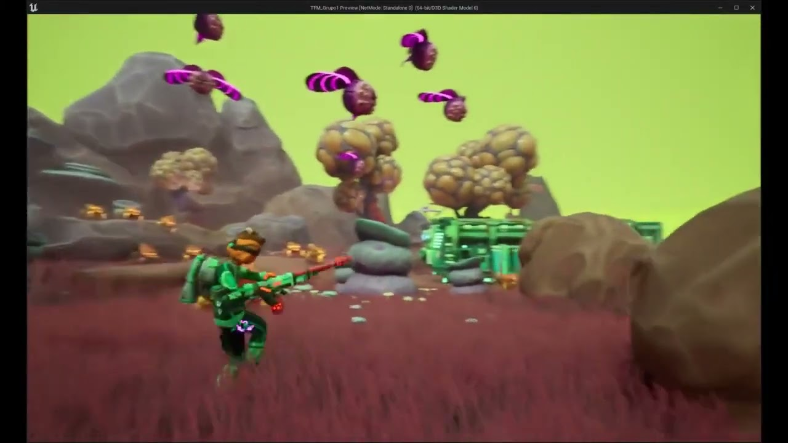
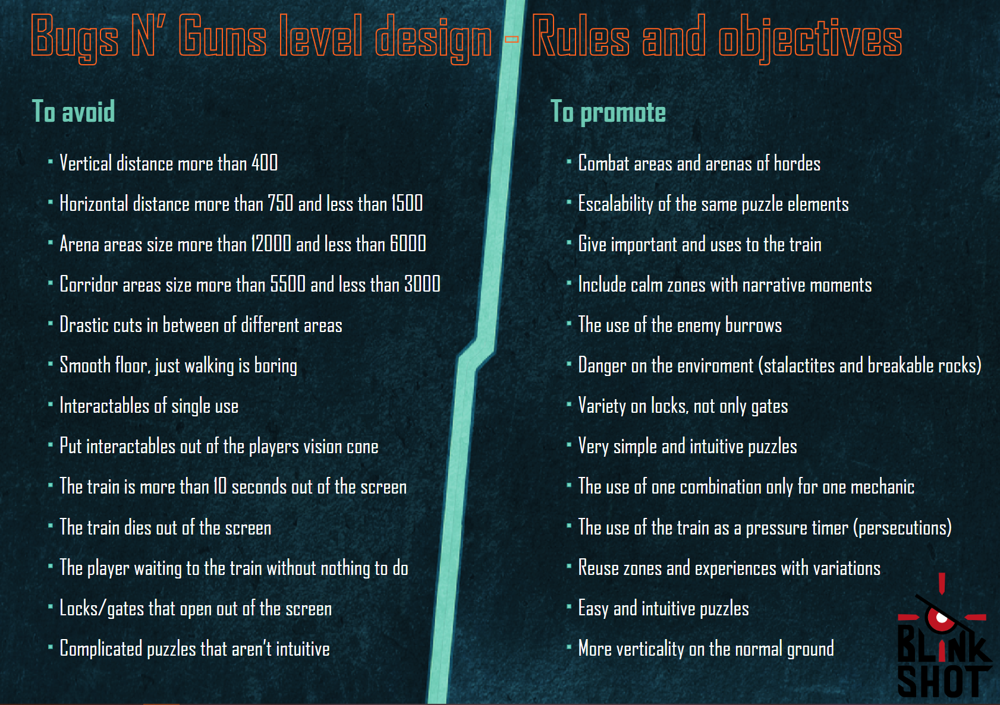
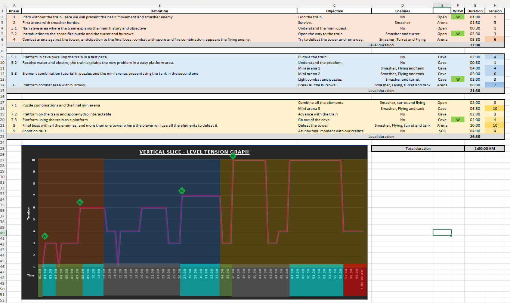
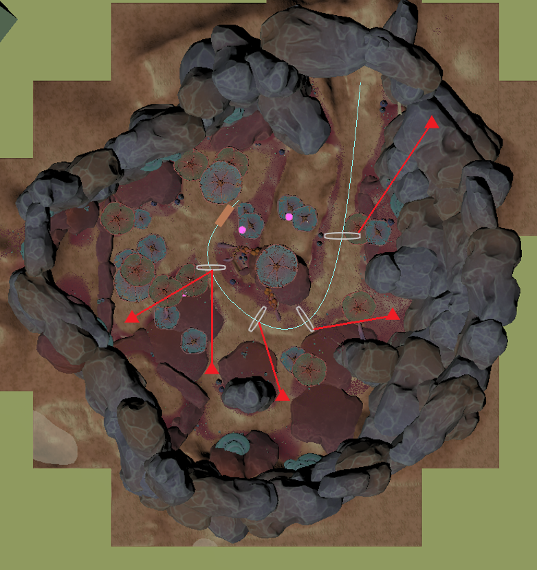
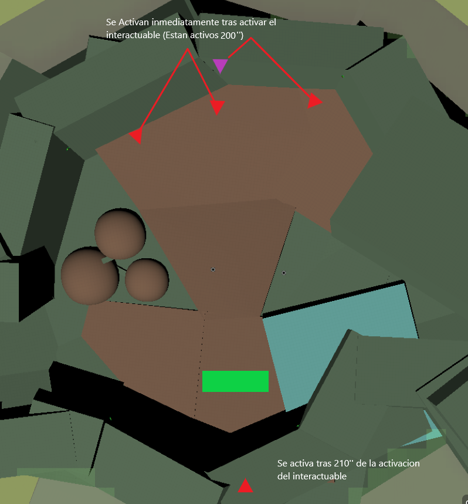

# LevelDesign | AlvaroCG-A_Portfolio

- **URL:** https://calvoalvaro12.wixsite.com/-lvarocg-a/copia-de-toolsandtech
- **Screenshots:** [desktop](desktop.png) · [mobile](mobile.png)

---
<!-- section 0 #comp-lwi7oeg32 — fondo #1e2025 -->

🔘 **[(sin texto)](https://sable-sandalwood-dee.notion.site/LEVEL-DESIGN-9b41a421d3874e27a6570153073ee32b)**

## Level design

### NOTION

🎬 **Vídeo youtube:** https://www.youtube.com/watch?v=tICzsxpXogc  

embed: https://www.youtube.com/embed/tICzsxpXogc

This video demonstrates the transition from 2D layout to level blocking.

In this section, I will showcase my work in the level design of Bugs N' Guns, including the creation of the beat chart and level layout, the design of arenas and encounters, and the prototyping of ideas for different parts of the level, from puzzles to the game's final stage.

🔘 **[(sin texto)](https://sable-sandalwood-dee.notion.site/Level-info-c69360a2bd75489696d31a57eb194598)**

#### Rules, objectives and general concept

### NOTION

761×536 en pantalla · original: https://static.wixstatic.com/media/1f3734_e895076b29774e25af47bb2714b029d2~mv2.png

I was directly involved in making decisions about the general concepts on which the level should be designed, including the feelings and experiences we wanted the player to have and how we planned to deliver it to the players.

I also focused on the technical aspects of the level to ensure our goals were achievable with the team and time we had available.

In the photo on the left, you can see the objective table, which outlines what to promote and what to avoid, as we decided to follow for the creation of the entire level.

---
<!-- section 1 #comp-ly5y34uv — fondo #1e2025 -->

🔘 **[(sin texto)](https://sable-sandalwood-dee.notion.site/Beat-chart-f3648a0a18444f2abd06e8bf40f4dfbd)**

#### General path and beatchart

### NOTION

739×437 en pantalla · original: https://static.wixstatic.com/media/1f3734_75f9fa624abd4e299e2a01c308ce1342~mv2.png

I have been involved in the design and creation of the beatchart for Bugs N' Guns.

This has been a tool we've used to define the rhythm, intensity, and duration of all the level phases.

We determined when fights would occur, with which enemies, and how intense they would be.

We also established where the puzzles would be located, what elements would be used to solve them, and how difficult they would be.

Additionally, we outline various 'WOW' moments where we wanted to leave an impact on the player

739×699 en pantalla · original: https://static.wixstatic.com/media/1f3734_faa9b11e66834021a9e846c9ccacd5e5~mv2.jpg

I was involved in designing and creating the 2D layout for all the levels in

Bugs N’ Guns, starting from initial whiteboard sketches and culminating in the final detailed map.

One of the major challenges we encountered in the level design process was managing the diverse gameplay and multiple biomes, combined with the player’s high mobility and vertical exploration, which complicated the task for our art team to visually complete the levels.

Consequently, our design strategy emphasized reusing areas efficiently while ensuring varied gameplay with minimal adjustments.

Three clear examples illustrate this approach from our initial 2D layout.

First, we designed two large arenas that players revisit.

By incorporating new elements upon reentry, such as the weapons available at that stage and slight changes in the environment, we create distinctly different gameplay experiences each time players enter these arenas.

Second, we developed three smaller arenas intended for more static combat. These arenas share identical wall and ceiling designs, allowing us to reuse most of the level’s decorative elements.

By altering the floor layout, enemy placements, and train positions, each of these arenas maintains a unique feel.

Lastly, the entry and exit passages of the largest arena are symmetrical caves, which eliminates the need for duplicating decorative efforts.

These sections focus on platforming, with a twist. In one, players are required to chase the train, while in the other, they use the train as a platform.

By designing a single, symmetrical passageway, we achieve two distinct platforming experiences.

---
<!-- section 2 #comp-ly5y4a3o — fondo #1e2025 -->

🔘 **[(sin texto)](https://sable-sandalwood-dee.notion.site/Combat-Design-f8c75218f2324956b44007a6a0f4c249)**

### NOTION

#### Arenas and encounters

During the development of Bugs N’ Guns, I was in charge of designing all the combat and encounters in the game.  
In this section, I will explain the process of designing two of the game’s arenas.

#### First Game Arena

613×652 en pantalla · original: https://static.wixstatic.com/media/1f3734_d3c56467562b4c34ac5d923c9e292d8a~mv2.png

This is the first arena in the game, so it needed to introduce the basic mechanics and dynamics of gameplay (combining weapons) in a controlled and accessible environment for players.

The train runs alongside a pit from which no enemies can emerge, ensuring that players only need to focus on one side of the train. This reduces the arena’s intensity, allowing players to concentrate on learning the mechanics without worrying about defending the train from multiple directions.

Naturally, the enemies in this arena are the most basic Smashers in the game. Their sole purpose is to serve as practice targets for players, posing a low, though not nonexistent, threat. Because of how these enemies function, arriving in waves, players must learn to combine their weapons to defeat them, which is the core gunplay mechanic.

At the end of the arena, the final enemy spawn will appear climbing down one of the rock walls in the environment. This is intended to teach players that enemies can climb and bypass obstacles, and that players can use their weapons to “paint” the walls the enemies traverse and defeat them before they reach the ground.

#### Fourth Game Arena

613×660 en pantalla · original: https://static.wixstatic.com/media/1f3734_ac732184f3ad4e2ab3998265c3c383d4~mv2.png

This arena is placed right after players receive their second weapon kit, the Electroplasma and the Hydrogel.

In this arena, the train will remain stationary at one end, while enemies attack in waves. The pacing and intensity of these waves are controlled through the enemy counter and the AI Director, allowing the encounter to maintain a controlled difficulty level.

The main goal of this arena is to allow players to experiment and have fun with their newly acquired weapons. Because of this, the overall challenge is intentionally kept at a moderate level, prioritizing learning and player expression over high pressure.

To support this objective, the arena layout creates a bottleneck that enhances the synergy between the two new weapons. By forcing enemies to move through narrow, aligned paths, players can take advantage of the piercing capabilities of the Electroplasm (DPS), allowing them to hit multiple enemies simultaneously. The Hydrigel water is designed to push enemies toward the abyss, creating an environmental hazard that rewards proper positioning and weapon combination.

Through this design, the arena reinforces weapon combination mechanics while providing a safe and engaging environment for players to understand the strengths and interactions of their new loadout.

---
<!-- section 3 #comp-ly5y4zey — fondo #1e2025 -->

🔘 **[Bugs N´Guns](https://calvoalvaro12.wixsite.com/-lvarocg-a/copia-de-bugs-n-guns)**
