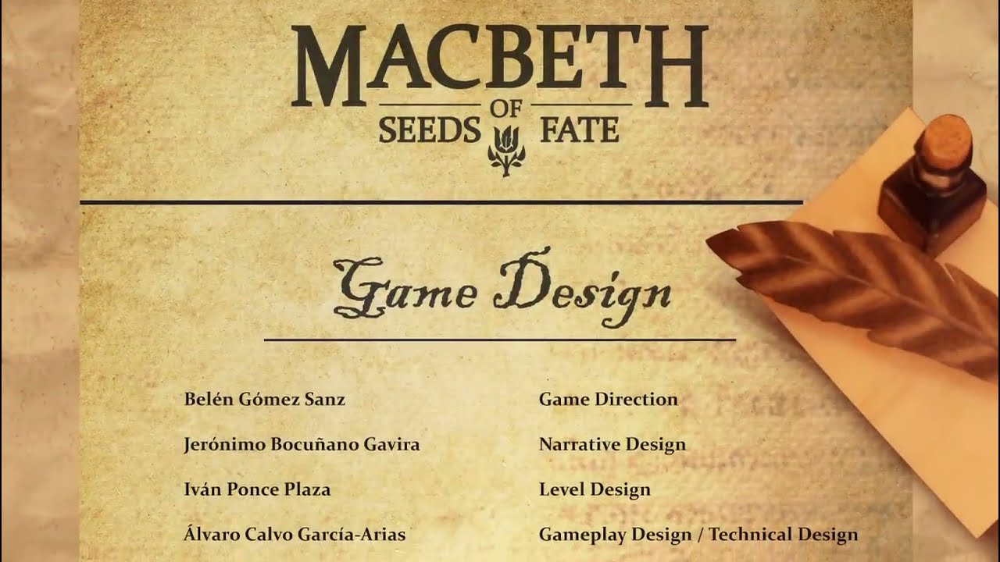
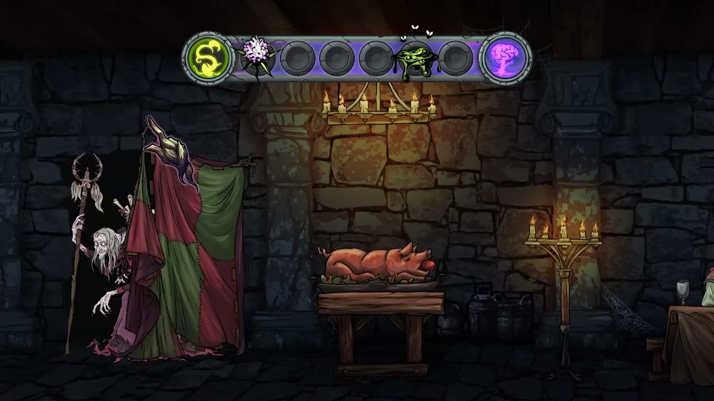

# Macbeth | AlvaroCG-A_Portfolio

- **URL:** https://calvoalvaro12.wixsite.com/-lvarocg-a/copia-de-winx
- **Screenshots:** [desktop](desktop.png) · [mobile](mobile.png)

---
<!-- section 0 #comp-mj7e0kl5 — fondo #1e2025 -->

🎬 **Vídeo youtube:** https://www.youtube.com/watch?v=5_zhbJUPkPs  

embed: https://www.youtube.com/embed/5_zhbJUPkPs

#### Macbeth:

#### Seeds of fate

221×93 en pantalla · original: https://static.wixstatic.com/media/1f3734_3a31610596cd4a799e7a68f5a6d0ef3d~mv2.png

67×67 en pantalla · original: https://static.wixstatic.com/media/1f3734_92f1c81b690746d0a17f2f16f4e3f745~mv2.png

Macbeth: Seeds of Fate is an interactive 3D adventure in which players will need to explore the environment to solve puzzles to unravel the story of Macbeth.

In this game, you will incarnate Shakespeare, who, with the help of some supernatural powers, must travel between two realities to discover and write the incredible play Macbeth.

I worked as Game Designer and Technical designer on this game in Divertifica

---
<!-- section 1 #comp-mj7ffy8q — fondo #1e2025 -->

## About this game:

This game has been canceled, but is playable in [Itch.io](https://divertifica.itch.io/macbeth-seeds-of-fate). What you see in the video is the vertical slice we created for funding purposes.

The game was initially conceived as a 2D minigame-based experience. You can see the trailer for that version on the right. However, we later shifted our focus toward a more ambitious storytelling approach.

The new concept was that the player would control Shakespeare, who, guided by the three Moirai (Fates), is led to an ancient castle where the events of the play took place.

With the ability to travel between the past and the present, the player would have to solve puzzles and unravel the story that Shakespeare would eventually write.

🎬 **Vídeo youtube:** https://www.youtube.com/watch?v=FyymwatUNNI  

embed: https://www.youtube.com/embed/FyymwatUNNI

---
<!-- section 2 #comp-mj7e0klh2 — fondo #1e2025 -->

## My contributions

Designed and prototype mechanics and systems, including, among others:

Player core mechanics:

The movement, Camera and control mechanics of the player (3C).

Dimensional transition mechanich.

All the puzzles and interactions.

Level Interactuables: Design, Programming and implementation of the level interactuables (Doors, candles, drawers, key...).

Level design: From beatchart to final going through layout and bloking, I designed the entire level.

Thecnical implementation of Shaders and final gameplay elements like puzzles or the transition mechanich.

Support the rest of the design team with the use of unreal engine, github and others.

## Project Details

Studio: Divertifica

Genre: Puzzle/Narrative

Platform: PC

Duration:

3/Dec/2023 - 10/Jan/2025

Team Size:

1 Creative director

3 Game Designers

3 Programmers

8 Artist

2 Sound designers

3 Cast

Engine used: Unreal Engine 5.

299×299 en pantalla · original: https://static.wixstatic.com/media/1f3734_92f1c81b690746d0a17f2f16f4e3f745~mv2.png
